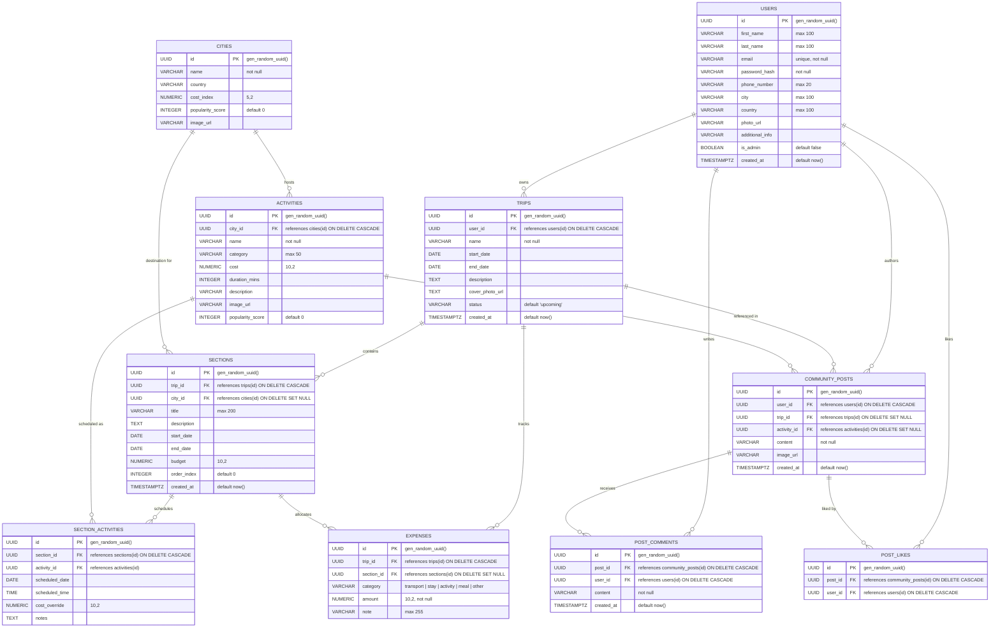

# GlobeTrotter — Entity Relationship (ER) Diagram

This document illustrates the complete database architecture, entity schemas, data types, primary keys (PK), foreign keys (FK), and relationship cardinalities for the **GlobeTrotter** travel planning platform.

---

## 1. Visual Entity Relationship Diagram (Mermaid)

---

## 2. Table Specifications & Relationships

### Core Domain: Identity & Trip Planning

| Entity | Description | Foreign Keys | Key Relationships |
| :--- | :--- | :--- | :--- |
| **`users`** | Registered user profiles & credentials | None | 1-to-N with `trips`, `community_posts`, `post_comments`, `post_likes` |
| **`trips`** | High-level trip containers (dates, cover photo, status) | `user_id` → `users.id` | 1-to-N with `sections`, `expenses`, `community_posts` |
| **`sections`** | Itinerary legs / stages (ordered by `order_index`, assigned to a city) | `trip_id` → `trips.id` `city_id` → `cities.id` | 1-to-N with `section_activities`, `expenses` |
| **`section_activities`** | Bridge table linking scheduled activities into specific sections with date, time, and cost overrides | `section_id` → `sections.id` `activity_id` → `activities.id` | N-to-1 with `sections`, N-to-1 with `activities` |
| **`expenses`** | Standalone & section-specific trip expense logs | `trip_id` → `trips.id` `section_id` → `sections.id` | N-to-1 with `trips`, N-to-1 with `sections` |

---

### Catalog Domain: Destinations & Activities

| Entity | Description | Foreign Keys | Key Relationships |
| :--- | :--- | :--- | :--- |
| **`cities`** | Global destination catalog with cost index & popularity | None | 1-to-N with `activities`, 1-to-N with `sections` |
| **`activities`** | Standard catalog of activities (cost, duration, category) | `city_id` → `cities.id` | 1-to-N with `section_activities`, 1-to-N with `community_posts` |

---

### Social & Community Domain

| Entity | Description | Foreign Keys | Key Relationships |
| :--- | :--- | :--- | :--- |
| **`community_posts`** | Traveler stories, reviews, tips & photo shares | `user_id` → `users.id` `trip_id` → `trips.id` `activity_id` → `activities.id` | 1-to-N with `post_comments`, `post_likes` |
| **`post_comments`** | Threaded comments on community posts | `post_id` → `community_posts.id` `user_id` → `users.id` | N-to-1 with `community_posts`, N-to-1 with `users` |
| **`post_likes`** | Unique likes per post and user (`uq_post_like_user`) | `post_id` → `community_posts.id` `user_id` → `users.id` | N-to-1 with `community_posts`, N-to-1 with `users` |

---

## 3. Cardinality Summary

1. **User to Trips**: `1 : N` (One user can own many trips; deleting a user cascades and deletes their trips).
2. **Trip to Sections**: `1 : N` (One trip has multiple sequential itinerary legs/sections ordered by `order_index`).
3. **City to Activities**: `1 : N` (One city contains many predefined activities).
4. **Section to Section Activities**: `1 : N` (A leg/section schedules multiple activities with date, time, and custom cost overrides).
5. **Trip to Expenses**: `1 : N` (A trip logs expenses categorized into stay, transport, dining, and activities).
6. **Community Post to Comments & Likes**: `1 : N` (A post receives many comments and unique user likes).
